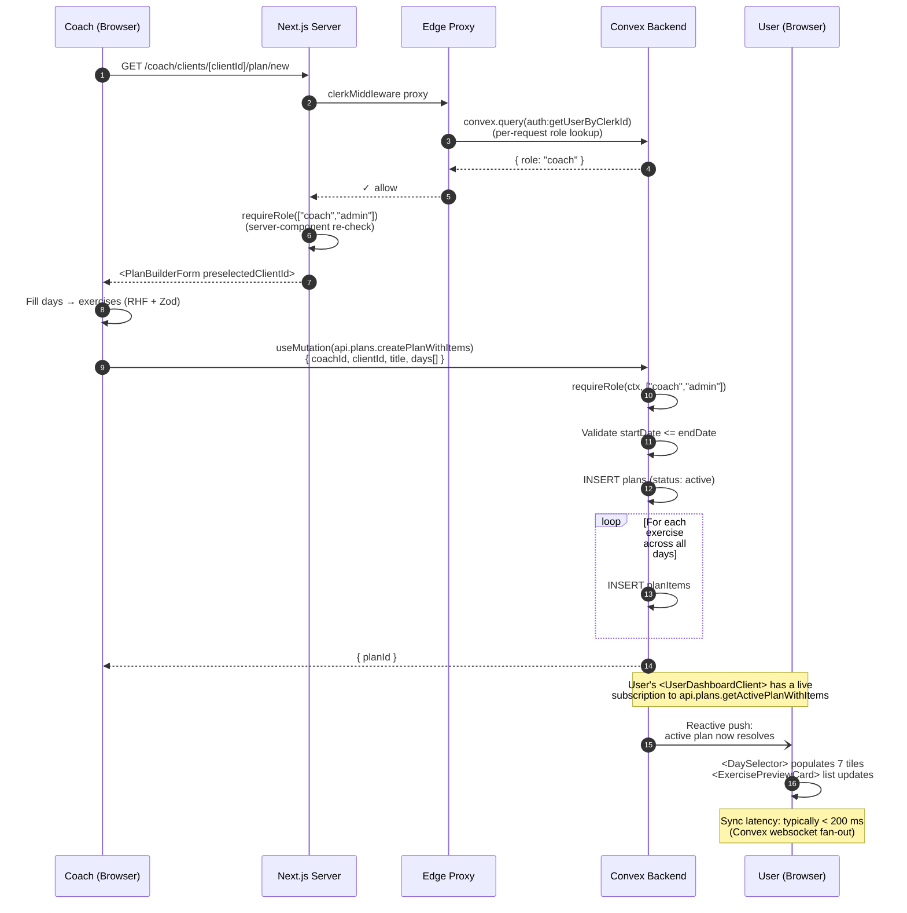
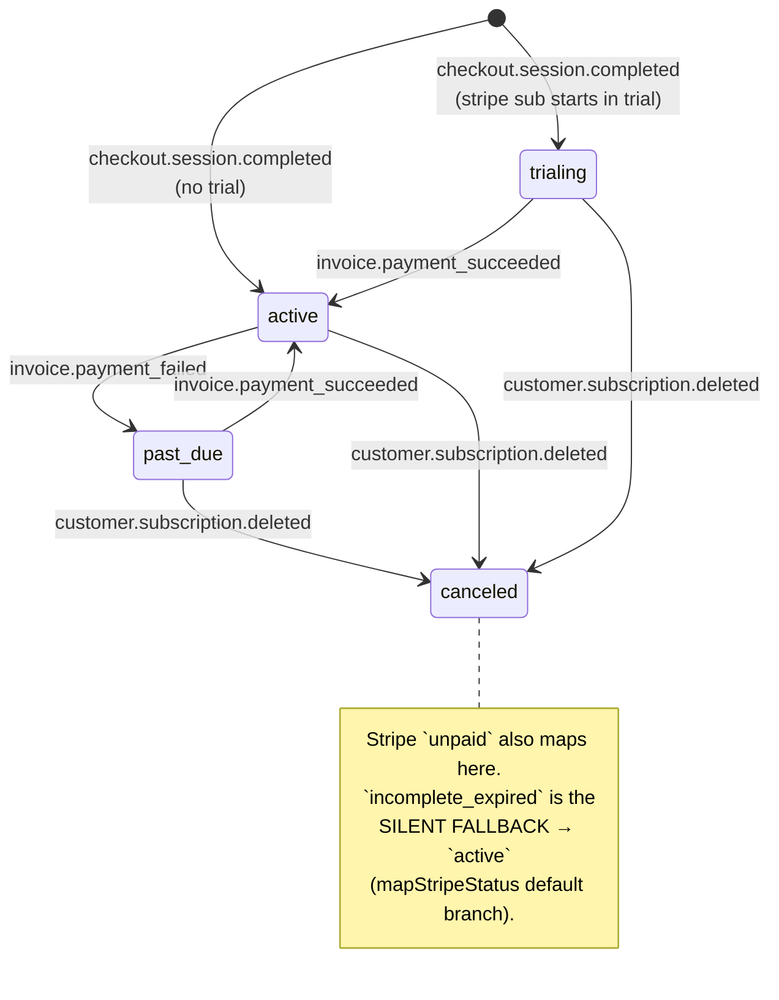
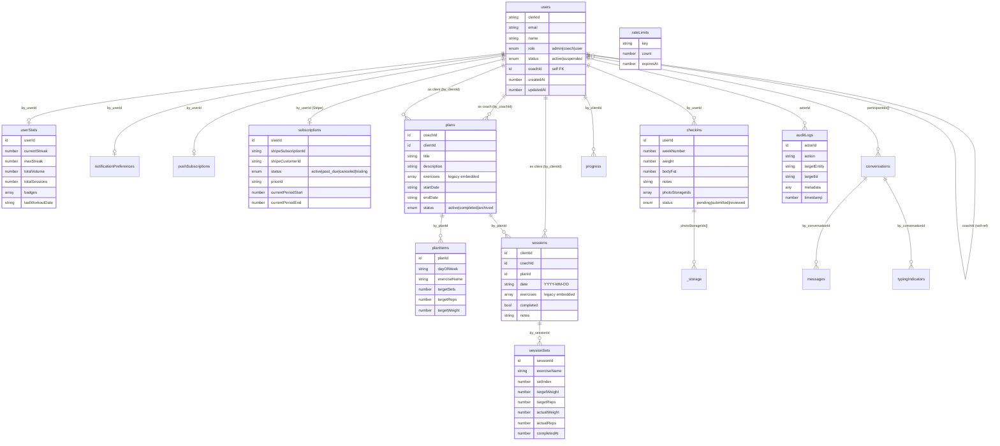

# 🏛️ GymPro: Architecture, User Flows & Business Logic

> **Status**: Source-of-truth document derived from an exhaustive, file-level audit of the codebase as of **2026-06-21**.
> **Audience**: Senior engineers onboarding to the project, and AI coding assistants ingesting this as primary context.
> **Convention**: All references use the form `path/to/file.ts:line`. Code citations are literal extracts from the repository — formulas, status strings, header names, cron schedules, and rate-limit windows are not paraphrased.

---

## 1. Executive Summary & Tech Stack

### 1.1 What is GymPro?

GymPro is a **B2B fitness coaching SaaS** that connects three distinct roles inside one reactive workspace:

- **Users (clients)** train against a coach-assigned weekly plan, log sets in real time, accumulate streaks/badges/PRs, and submit weekly check-ins with progress photos.
- **Coaches** build structured weekly plans (days → exercises → sets/reps/weight), monitor a roster of assigned clients, review per-client progress (volume charts, 1RM trends, recent-session feed), and message clients in real time.
- **Admins** govern the platform: manage all users, suspend/reinstate accounts (with Clerk-side enforcement), change roles, audit every privileged action, and observe system health via a "Mission Control" dashboard.

The product is presented as a **dark-mode-first PWA** with neon-accent visual language (`#abd600` lime + `#00dce5` teal gradient throughout), offline-aware UI affordances, and Web Push reminders.

### 1.2 Core Stack

| Layer | Technology | Version (`package.json`) | Notes |
|---|---|---|---|
| Framework | **Next.js** | `16.2.9` | App Router; middleware is exported as `proxy` per Next 16 rename |
| UI Runtime | **React** | `19.2.4` | React Compiler enabled via `babel-plugin-react-compiler` and `next.config.ts:50` |
| Backend (DB + functions) | **Convex** | `1.41.0` | Real-time reactive queries, mutations, actions, crons, file storage |
| Auth | **Clerk** | `7.5.3` (Next), `3.8.2` (backend SDK) | JWT identity → Convex `users.clerkId` mapping |
| Billing | **Stripe** | `22.2.1` | Subscription lifecycle via webhook into Convex `subscriptions` table |
| Styling | **Tailwind v4** + `tw-animate-css` | `4.x` | Single-file design tokens in `src/app/globals.css` |
| Forms | **react-hook-form** + **Zod** | `7.79` / `4.4.3` | `@hookform/resolvers` glue |
| Charts | **Recharts** | `3.8.1` | Used in coach progress dashboard and admin Mission Control |
| PDF | **@react-pdf/renderer** | `4.5.1` | Client-side coach reports — never persisted |
| Notifications | **web-push** + Service Worker | `3.6.7` | VAPID-signed Web Push; Convex Node action delivers |
| Webhook signing | **svix** | `1.95.2` | Clerk webhook verification (`svix-id`/`svix-timestamp`/`svix-signature` headers) |
| Observability | **Sentry** (`10.58`) + **PostHog** (`1.390` browser, `5.38` node) | — | Sentry traces at 100% in server/edge, 10% in client production |
| PWA / Offline | Custom `public/sw.js` | — | Cache-first for static, network-first for documents; **Convex traffic is bypassed** |
| Testing | **Vitest** (unit), **Playwright** (e2e), **Storybook** (components) | — | `vitest.config.ts`, `playwright.config.ts`, `.storybook/` |

### 1.3 High-Level Architectural Pattern

**Real-time, serverless, role-stratified B2B SaaS** with three concurrent boundaries of authorization:

```
┌────────────────────────────────────────────────────────────────────────┐
│  ① Edge Proxy (src/proxy.ts) — Clerk middleware redirects unauth      │
│     to /sign-in, role-gates /coach/* and /admin/* via Convex lookup   │
├────────────────────────────────────────────────────────────────────────┤
│  ② Server-Component Guard (src/lib/auth-server.ts) — requireRole()    │
│     re-checks role in RSCs and route handlers; redirects on mismatch  │
├────────────────────────────────────────────────────────────────────────┤
│  ③ Convex Function Guard — requireRole(ctx, [...]) / requireOwnership │
│     enforces auth inside every mutation/query at the data boundary    │
└────────────────────────────────────────────────────────────────────────┘
```

The **authoritative authorization boundary is layer ③** (Convex). Layers ① and ② are UX redirects that are bypassable by any non-redirect-following client.

The frontend is a **single Next.js application** that branches by URL prefix (`/user/*`, `/coach/*`, `/admin/*`). The backend is a **single Convex deployment** organized into domain modules (`convex/auth.ts`, `convex/plans.ts`, `convex/sessions.ts`, `convex/gamification.ts`, etc.). External services (Clerk, Stripe, Resend, web-push) integrate through HTTPS webhooks (`src/app/api/webhooks/*`) and Convex Node actions (`convex/clerkActions.ts`, `convex/emailActions.ts`, `convex/pushActions.ts`).

---

## 2. Role-Based User Journeys (The Flows)

### 2.1 The User (Client) Flow

#### Onboarding & Auth

1. The visitor lands on `/` (`src/app/page.tsx`) and clicks "Sign up", routing to `/sign-up/[[...sign-up]]/page.tsx` which renders Clerk's prebuilt `<SignUp />` widget (no `redirectUrl` props are passed — destination is governed by Clerk dashboard config and the proxy).
2. On successful sign-up, **Clerk fires a `user.created` webhook** to `POST /api/webhooks/clerk` (`src/app/api/webhooks/clerk/route.ts:124`). The route:
   - Verifies `svix-id`/`svix-timestamp`/`svix-signature` against `CLERK_WEBHOOK_SECRET` using `svix.Webhook.verify` (`route.ts:94-117`).
   - Validates the payload with Zod (`userCreatedSchema` at `route.ts:17`).
   - Resolves the role via `resolveRole(public_metadata)` — accepts only `"admin"`, `"coach"`, or `"user"`, defaults to `"user"` (`route.ts:54-60`).
   - Calls Convex mutation `auth:syncUser` with `{ clerkId, email, name, role, avatarUrl }`.
3. `syncUser` (`convex/auth.ts:96`) detects the webhook context by the **absence** of `ctx.auth.getUserIdentity()` (`auth.ts:105-109`) and trusts the call because the route already verified the SVIX signature. It upserts the `users` row by `clerkId`.
4. After sign-in, **the edge proxy redirects authenticated users away from `/sign-in` and `/sign-up` to `/dashboard`** (`src/proxy.ts:39-44`), which is the de facto post-auth landing page.
5. **Coach assignment is admin-driven**, not self-serve. A new user's `coachId` is `undefined` until an admin runs `assignCoachToUser` (`convex/users.ts:185`) from the admin user-management sheet. The user-side dashboard's `EmptyState` renders a "Contact Coach" CTA that is currently a stub (`src/components/user/user-dashboard-client.tsx:248-301`).

#### The Workout Loop

The user lands on `/user/dashboard` (`src/app/user/dashboard/page.tsx`), which renders `<UserDashboardClient />`. This single-screen "My Week" view subscribes — via the `use-active-plan` hook (`src/hooks/use-active-plan.ts`) — to:

- `api.auth.getUserByClerkId({ clerkId })`
- `api.plans.getActivePlanWithItems({ clientId })`
- `api.sessions.getByClient({ clientId })`

It renders a weekly `<ProgressRing>`, two summary pills (workout days + completed), a `<DaySelector>` (7 tiles with a pulsing dot on `isToday` and a checkmark badge on `isCompleted`), a `<Stagger>`-animated list of `<ExercisePreviewCard>` for the active day, and a sticky "Start Workout" `<Button>` linking to `/user/session`.

**Today's day is computed in browser local time** (`use-active-plan.ts:79-84`) — `new Date().getDay()` remapped to Monday-first ISO order. No timezone normalization.

When the user taps "Start Workout" they navigate to `/user/session`, which mounts `<SessionTracker sessionId={null} />`. The tracker walks a 6-state machine:

1. Clerk/Convex still loading → `<SessionSkeleton />`.
2. No active session id → "Ready to begin today's workout?" with a Start button.
3. User clicks Start → `ensureSession()` (`session-tracker.tsx:39-51`) calls `useMutation(api.sessions.createForToday)({ clientId })`. `createForToday` (`convex/sessions.ts:105-165`):
   - Idempotent: returns the existing in-progress session for today if one exists.
   - Resolves today's date as **UTC** `YYYY-MM-DD` and `dayOfWeek` from `new Date().getDay()`.
   - Filters `planItems` to today and expands each item's `targetSets` into per-set entries.
   - Returns `null` if no items are scheduled today (does not throw).
4. Session loading → skeleton.
5. Active session → header showing `{completedSets}/{totalSets}` with a 1 px lime→teal gradient progress bar, then a list of `<ExerciseTracker>` cards.

Per-exercise, `<ExerciseTracker>` renders one `<SetInput>` per target set. Each `<SetInput>` exposes:
- Numeric weight input with ±2.5 kg `Minus`/`Plus` buttons.
- Numeric reps input with ±1 buttons.
- A `Check` button (`set-input.tsx:134-146`) that calls `onComplete()`.

`handleComplete` (`exercise-tracker.tsx:52-69`) fires `useMutation(api.sessions.logSet)({ sessionId, exerciseName, setIndex, targetWeight, targetReps, actualWeight, actualReps })`. `logSet` (`convex/sessions.ts:171-225`) validates `0 ≤ setIndex ≤ 20`, refuses if the session is already completed, and **upserts on the composite key `(sessionId, exerciseName, setIndex)`** via the `sessionSets.by_sessionId_exerciseName` index. There is **no `withOptimisticUpdate`** — the UI's completed checkmark flips reactively when the Convex subscription re-emits.

The user finishes by tapping "Finish Workout" → `useMutation(api.sessions.finish)({ sessionId })` (`convex/sessions.ts:252`). `toast.success("Workout completed!")` fires and the router pushes back to `/user/dashboard`.

> **AUDIT FLAG — PR celebration is wired but dormant.** `usePRDetection` (`src/hooks/use-pr-detection.ts:21-73`) and `<PRCelebration>` (`src/components/gamification/pr-celebration.tsx`) exist and are fully animated (50-particle CSS confetti, 12-sparkle ring, 3.5 s auto-dismiss, `navigator.vibrate([100, 50, 200])`). However, **`<ExerciseTracker>` does not import or invoke them**, so `api.gamification.checkForPR` is never called from the live workout flow. The infrastructure ships dark.

#### Gamification & Progress

- **PR detection** lives in `convex/gamification.ts:48-127` (`checkForPR`). Algorithm and exact formula are documented in **Section 3.1**.
- **Streaks** live in `convex/gamification.ts:130-239` (`updateUserStats`). Algorithm in **Section 3.2**.
- **Badges** (`gamification.ts:7-18`): `first_session`, `7_day_streak`, `14_day_streak`, `30_day_streak`, `100k_club`, `500k_club`, `1m_club`, `first_pr`, `pr_machine`, `pr_legend`. Auto-award occurs inside `updateUserStats` for sessions/streaks/volume clubs and inside `checkForPR` for `first_pr` only — `pr_machine`/`pr_legend` are defined but **never auto-awarded by code**.
- **Weekly check-ins** (`src/components/checkins/weekly-checkin-form.tsx`) are a 3-step wizard: Photos (≤ 4) → Measurements (weight, body-fat) → Notes. Each photo is uploaded by calling `api.checkins.generateUploadUrl` then `POST`ing the file to the signed URL; the returned `storageId` is collected and submitted alongside the form via `api.checkins.submitCheckin`. Week number is computed client-side (non-strict ISO) at `weekly-checkin-form.tsx:84-88`.

#### Sequence Diagram — Logging a set & PR detection

```mermaid
sequenceDiagram
    autonumber
    participant U as User (Browser)
    participant SW as Service Worker
    participant N as Next.js Server
    participant CV as Convex Backend
    participant G as gamification.ts

    U->>N: GET /user/session
    N->>U: HTML + JS bundle (SessionTracker)
    U->>CV: useMutation(api.sessions.createForToday)
    CV->>CV: Find/insert session row<br/>seed exercises from planItems
    CV-->>U: { sessionId }

    Note over U,CV: Reactive subscription:<br/>useQuery(api.sessions.getSessionWithSets)

    U->>U: Enter weight/reps, tap Check
    U->>CV: useMutation(api.sessions.logSet)<br/>{ sessionId, exerciseName, setIndex,<br/>  actualWeight, actualReps }
    CV->>CV: Validate ownership<br/>Upsert by (sessionId, exerciseName, setIndex)
    CV-->>U: ✓ (reactivity re-emits getSessionWithSets)
    Note over U: Set badge flips lime green<br/>via reactive re-render

    rect rgb(40,40,55)
    Note over U,G: PR celebration path (wired but dormant —<br/>not invoked from ExerciseTracker today)
    U->>CV: useMutation(api.gamification.checkForPR)
    CV->>G: Iterate prior sessionSets via<br/>by_clientId + by_sessionId_exerciseName
    G->>G: 1RM = weight × (1 + reps/30)<br/>Compare against historical max
    G-->>U: { isPR: true, previousBest1RM, newBest1RM }
    U->>U: navigator.vibrate([100,50,200])<br/>Mount <PRCelebration> for 3500 ms
    end

    SW--xCV: Service worker bypasses<br/>convex.cloud traffic (sw.js:44-47)
```



---

### 2.2 The Coach Flow

#### Client Management

The coach lands on `/coach/dashboard` (`src/app/coach/dashboard/page.tsx`), which server-side calls `requireRole(["coach", "admin"])` then mounts `<CoachDashboardClient />`. The client component fetches three queries in parallel:

- `api.auth.getUserByClerkId`
- `api.users.getCoachClients({ coachId })`
- `api.users.getCoachMetrics({ coachId })`

`<MetricCards>` (`src/components/coach/metric-cards.tsx`) surfaces three KPIs at the top: **Active Clients**, **Sessions This Week**, **Clients Without Plans**. The week boundary is Monday, computed by `getWeekStart()` in `convex/users.ts:6` using local-machine `new Date().getDay()`.

The roster is `<ClientTable>` (`src/components/coach/client-table.tsx`), a non-virtualised `<Table>` showing per-client: **Client** (avatar+name+email), **Status** badge (`active`/`plan_pending`/`stale`), **Active Plan**, **Last Workout** with `getDaysSince()` relative time, **Engagement** bar (`completedThisWeek / weeklySessions.length`, color-coded green ≥75 / amber ≥40 / red below), and hover **Actions**.

Status is **derived server-side** in `getCoachClients` (`convex/users.ts:61-66`):
- No active plan → `"plan_pending"`
- Last session > 7 days ago → `"stale"`
- Otherwise → `"active"`

A `<ChatPanel>` button is mounted in the dashboard header, providing a Sheet-based floating inbox without leaving the dashboard.

**Adding a client** (`/coach/clients/new`) is currently a **raw Clerk-ID assignment form**, not an email-invite flow. The form (`src/app/coach/clients/new/client-form.tsx`) calls `api.auth.assignCoach({ clientClerkId, coachClerkId })`. Note: this mutation enforces `requireRole(ctx, ["admin"])` (`convex/auth.ts:185`), so it will throw for coaches in practice despite the UI allowing them in.

#### Plan Architecture

`/coach/plans/new` and `/coach/clients/[clientId]/plan/new` both mount the same `<PlanBuilderForm>` (`src/features/plan-builder/plan-builder-form.tsx`); the latter passes `preselectedClientId` from `params`.

The Zod schema (`src/features/plan-builder/schema.ts:31-52`) requires:
- `title` (1–100 chars), `description` (1–500), `clientId`, `startDate`, `endDate` (ISO strings).
- `days[]` (≥ 1) with a `.refine` enforcing unique `dayOfWeek` values.
- Each day's `exercises[]` (≥ 1) with `name` (1–100), `targetSets` (1–100), `targetReps` (1–1000), `targetWeight` (0–9999).

Form state uses `react-hook-form` + `zodResolver`. `useFieldArray` drives both `days` (parent) and `exercises` (per `<DayCard>`). `useWatch` powers a live `<PlanPreview>` sidebar. Day add/remove buttons cap at 7 days (`plan-builder-form.tsx:500`); the last day cannot be removed. Exercise rows can be added/removed but **are not reorderable** — the `GripVertical` icon on `<ExerciseRow>` is cosmetic only.

Submission calls one Convex mutation — `api.plans.createPlanWithItems` (`convex/plans.ts:105-147`) — which atomically:
1. Inserts a single `plans` row with `status: "active"` and an empty embedded `exercises: []` array (the legacy dual data model).
2. Iterates each exercise and inserts one `planItems` row per exercise, carrying `dayOfWeek`, `targetSets`, `targetReps`, `targetWeight`.

The whole operation is one Convex transaction.

#### Analytics & Review

`/coach/clients/[clientId]/progress` mounts `<ClientProgressView>` (`src/app/coach/clients/[clientId]/progress/client-progress-view.tsx`). It fires **a single** Convex query — `api.sessions.getClientProgressDashboard({ clientId })` — which server-side aggregates everything (`convex/sessions.ts:267-452`):

- **`totalVolumeThisMonth`** — sum of `actualWeight × actualReps` across sets in completed sessions where `s.date >= monthStart`.
- **`workoutStreak`** — backward walk from today (today may be skipped — grace day), capped at 365 iterations, breaks on first gap.
- **`prsHit`** — count of every set whose `actualWeight` beat the running per-exercise max. **Raw-weight comparison** — different formula from the gamification module (see Section 3.1).
- **`volumeData`** — 30-day zero-filled time series.
- **`topExercises`** — top 5 by volume with **Brzycki 1RM** estimate `Math.round(maxWeight × (36 / (37 − 10)))` — note `reps = 10` is **hardcoded** at `sessions.ts:401`.
- **`recentSessions`** — last 5 with completion rate and total volume.

Charts use **Recharts**. `<VolumeChart>` is an `<AreaChart>` with an OKLCH neon vertical gradient. `<RecentSessionsFeed>` is a timeline list. `<ExerciseProgressionTable>` shows last weight, est. 1RM, and a "PR"/"Gap" trend badge.

Coach inbox lives at `/coach/messages` and re-uses `<ChatLayout>` from `src/components/messaging/` — a responsive split-pane with `<ConversationList>` (left) and `<MessageThread>` (right). On mobile (< 768 px) only one pane is visible at a time. Search is client-side and filters by participant name or last-message body.

PDF reports are generated client-side with `@react-pdf/renderer` (`<ReportGenerator>` at `src/components/reports/report-generator.tsx:46`). The download filename is `GymPro-Report-{clientName}-{period}.pdf`. **Reports are never persisted** — they are streamed directly to the browser download.

#### Sequence Diagram — Coach creates a plan & it syncs to the client



---

### 2.3 The Admin Flow

#### Platform Governance

`/admin` redirects to `/admin/dashboard`. The admin layout (`src/app/admin/layout.tsx:5-17`) server-side calls `await requireRole(["admin"])`, mounts `<SidebarNav>` and `<AdminHeader>`, and reserves `pl-[240px]` for the sidebar on `md+`.

`<AdminHeader>` renders a sticky bar with a back-arrow to `/dashboard`, a `Shield` "Admin Mode" badge in amber, and a "Search ⌘K" button. The Command-K palette (`src/app/admin/command-k.tsx`) listens for `Cmd/Ctrl+K`, queries `api.auth.searchAll` (admin-only, `convex/auth.ts:398`) for fuzzy matches against **users** (name/email, max 5), **plans** (title, max 5), and **sessions** (date substring, max 5). A static "Quick Actions" group offers three router-push destinations.

The **user management table** (`/admin/users` → `<UsersDataTable>` at `src/components/admin/users/users-data-table.tsx`) reads `api.auth.listAllUsers({ role?, search?, status? })`. Columns: User, Role (badge via `ROLE_BADGE_STYLES`), Status (active/suspended pill), Coach, Joined, Actions. Filtering and pagination are **client-side** (`PAGE_SIZE = 10`); a 5-button windowed paginator handles scrolling.

The row Action button opens `<UserManagementSheet>` — a Radix Sheet showing:
1. **Overview triplet**: Sessions, Active Plans, Streak (`api.gamification.getUserStats`).
2. **Role Management**: Select + "Save Role" button that opens `<RoleChangeDialog>`.
3. **Coach Assignment** (only when role is `user`): Select populated by `api.auth.listAllUsers({ role: "coach" })` + Assign button → `api.users.assignCoachToUser`.
4. **Danger Zone**: Suspend → `<SuspendUserDialog>` (or "Reinstate" — currently **stubbed with a TODO toast** even though `convex/users.ts:307` `unsuspendUser` exists).

**Role change flow** (`<RoleChangeDialog>` → `api.users.updateUserRole`, `convex/users.ts:134-182`):
1. `requireRole(ctx, ["admin"])`.
2. Self-demotion guard: refuses to demote the last remaining admin (counts via `users.by_role` index).
3. No-op if role unchanged.
4. `ctx.db.patch(targetUserId, { role: newRole, updatedAt: Date.now() })`.
5. `ctx.runMutation(api.audit.logAuditEvent, { action: "ROLE_CHANGE", metadata: { oldRole, newRole } })`.

> **NOTE — Role changes do NOT propagate to Clerk.** The mutation does not call `clerkActions`. The role lives only in the Convex `users` table. The edge proxy reads it back from Convex on every request.

**Suspension flow** (`<SuspendUserDialog>` → `api.users.suspendUser`, `convex/users.ts:255-304`):
1. `requireRole(ctx, ["admin"])`.
2. Self-suspension blocked.
3. `ctx.db.patch(targetUserId, { status: "suspended" })`.
4. Audit log `"USER_SUSPENDED"`.
5. **`ctx.scheduler.runAction(internal.clerkActions.banUserInClerk, { userId })`** — out-of-band Clerk-side ban via `@clerk/backend`'s `clerkClient.users.banUser(clerkId)` (`convex/clerkActions.ts:12`).

The suspend dialog requires the admin to **type the user's exact email** as a destructive-action confirmation gate.

#### Billing & Subscriptions

The Stripe webhook (`src/app/api/webhooks/stripe/route.ts`) maintains the `subscriptions` table. Lifecycle is detailed in **Section 3.4** and **Section 5.2**.

> **AUDIT FLAG — Subscription gating is unimplemented.** The `subscriptions` schema, webhook ingestion, and `subscriptions:upsert` Convex mutation all exist, **but no Convex function gates coach features on subscription status**. There is no `if (subscription.status !== "active") throw` anywhere in the audited functions. The admin Mission Control likewise renders no MRR/active-subs KPI.

> **AUDIT FLAG — Stripe never flips the user role.** A successful `checkout.session.completed` does not promote the user to `coach`. Roles must currently be elevated manually (Clerk dashboard, admin tool, or a missing handler).

#### Observability

`<MissionControl>` (`src/components/admin/mission-control.tsx`) is composed of four widgets:

- **`<HealthGrid>`** — `api.auth.getSystemHealth` returns `{ totalUsers, usersByRole, activeSessions, sessionsToday, activePlans, totalPlans, volumeLast24h }` via a single parallel batch read of `users`/`sessions`/`plans`/`sessionSets` (`convex/auth.ts:340-355`).
- **`<ErrorRateWidget>`** — **MOCK DATA** (`mission-control.tsx:33-47`): `generateErrorRateData()` synthesizes 24 hourly buckets with `Math.random()`. Comment is explicit: *"replace with real Sentry API when ready."*
- **`<ActivityFeed>`** — `api.audit.getRecentAuditLogs({ limit: 15 })` (`convex/audit.ts:58`) using `auditLogs.by_timestamp` index, enriched with `actorName`/`actorEmail`. Color-coded by action keyword: `"delete"` → destructive red, `"update"`/`"assign"` → amber, `"syncUser"` → neon green.
- **`<QuickActions>`** — four external-link buttons (Sentry, PostHog, Convex, Vercel).

The dedicated **`<AuditLogViewer>`** (`src/components/admin/audit-log-viewer.tsx`) is a flat non-virtualised list of `<div>` rows — no `<Table>` — capped at 50 results. Stats strip computes `getAuditLogStats` (unbounded `collect()` — see Section 6 hazard list). Filters (action text + date range) are **inert in the current UI** — they exist as state but the query is never re-issued with them. Export-to-CSV works only against the loaded 50 rows.

---

## 3. Core Business Logic & System Rules (CRITICAL)

This section documents the invisible rules. Formulas are quoted literally from the codebase.

### 3.1 PR (Personal Record) Calculation

GymPro contains **two different PR detection algorithms** that disagree.

#### 3.1.1 Live PR detection — Epley 1RM (gamification module)

`convex/gamification.ts:48-127` (`checkForPR`). On call, the function:

1. Computes the proposed PR's estimated 1-rep-max:
   ```
   const estimated1RM = args.weight * (1 + args.reps / 30);
   ```
   (`gamification.ts:60`) — this is the **Epley formula**.
2. Iterates all sessions for `args.userId` via `sessions.by_clientId` index.
3. For each prior session (excluding the current one — `if (session._id === args.sessionId) continue;`), reads `sessionSets` filtered to the same `exerciseName` via the `by_sessionId_exerciseName` composite index.
4. Computes `prev1RM = set.actualWeight * (1 + set.actualReps / 30)` for each historical set and tracks `previousBest1RM`.
5. The PR condition (`gamification.ts:92-94`):
   ```
   if (estimated1RM > previousBest1RM || (previousBest1RM === 0 && args.weight > 0)) {
     isPR = true;
   }
   ```
6. On PR, awards the `first_pr` badge (only — never `pr_machine` or `pr_legend`).
7. Returns `{ isPR, previousBest1RM, newBest1RM, previousBestWeight, newBestWeight }` for client-side celebration UI.

#### 3.1.2 Coach-dashboard PR count — Raw Weight (sessions module)

`convex/sessions.ts:357-371` inside `getClientProgressDashboard`:
```
const current = exerciseBestWeight.get(set.exerciseName) ?? 0;
if (set.actualWeight > current) {
  exerciseBestWeight.set(set.exerciseName, set.actualWeight);
  prCount++;
}
```
This is a **raw weight** comparison — it ignores reps entirely.

#### 3.1.3 Coach-dashboard 1RM trend — Brzycki, hardcoded 10 reps

In the same dashboard query, the `topExercises` array uses:
```
estimated1RM = Math.round(stats.maxWeight * (36 / (37 - 10)))
```
(`sessions.ts:401`). This is the **Brzycki formula**, but the `reps` value is **hardcoded to 10** rather than read from the actual record-setting set. This means the displayed "Est. 1RM" is always `maxWeight × 36/27 = maxWeight × 1.333` — a constant multiplier, not a true Brzycki estimate.

#### 3.1.4 Where stored / signaled

- Live PR (gamification): no persisted "PR" entity. PRs are detected on demand by walking history. Only side effect on PR is unlocking `first_pr` in `userStats.badges[]`.
- Coach dashboard PR count: ephemeral — recomputed on every dashboard load.
- Celebration channel: `checkForPR` return value → `usePRDetection.lastPR` state → `<PRCelebration>` modal. **NOT WIRED INTO THE LIVE WORKOUT TRACKER TODAY** (see Section 6).

### 3.2 Streak Logic

Source of truth: `convex/gamification.ts:130-239` (`updateUserStats`).

#### 3.2.1 Day boundary — UTC midnight

Session dates are stored as `"YYYY-MM-DD"` strings. The streak math parses them into UTC midnight timestamps:
```
const [year, month, day] = args.sessionDate.split("-").map(Number);
const todayUTC = Date.UTC(year, month - 1, day);
```
(`gamification.ts:149-155`). The choice is explicit — the comment cites "avoid timezone issues."

#### 3.2.2 Workout day definition

A "workout day" is whichever date the **caller** passes in `args.sessionDate`. The function does not check that a session was actually completed. By convention, the client calls `updateUserStats` on session-finish.

#### 3.2.3 Streak transition rules

```
diffDays = Math.floor((todayUTC - lastDateUTC) / (1000 * 60 * 60 * 24));
```
- `diffDays === 1` → `newStreak = currentStreak + 1` (consecutive)
- `diffDays === 0` → unchanged (same-day re-log)
- `diffDays !== 0 && diffDays !== 1` (gap ≥ 2 OR backwards date) → **`newStreak = 1` (reset to 1, not 0)**
- `lastWorkoutDate === null` → `newStreak = 1`

`maxStreak = Math.max(existing?.maxStreak ?? 0, newStreak)`.

#### 3.2.4 No grace period

A single missed day immediately resets the streak. The streak field never decays on its own — it just stops incrementing until the next session triggers `updateUserStats`.

#### 3.2.5 Dashboard streak (separate calculation)

`convex/sessions.ts:341-355` computes a **second, ephemeral streak** for the coach progress dashboard:
- Collects distinct dates of completed sessions for the client.
- Walks backward day-by-day from today, **allowing today to be skipped** (since today might not yet have a session).
- Breaks on first gap; capped at 365 iterations.

This streak can disagree with `userStats.currentStreak` because (a) it uses different gap semantics and (b) `userStats` is only updated when the client explicitly calls `updateUserStats`, while the dashboard streak walks the source-of-truth `sessions` table.

### 3.3 Role-Based Access Control (RBAC)

Source of truth: `convex/auth.ts:1-83`.

#### 3.3.1 Hierarchy

```
ROLES = ["admin", "coach", "user"]
ROLE_HIERARCHY = { admin: 3, coach: 2, user: 1 }
```

#### 3.3.2 `requireRole(ctx, allowedRoles)` — `convex/auth.ts:28-52`

1. `ctx.auth.getUserIdentity()` → throws `"Unauthorized: not authenticated"` if null.
2. Looks up `users` by `clerkId === identity.subject` via the `by_clerkId` index → throws `"Unauthorized: user not found in database"` if missing.
3. Computes:
   - `userLevel = ROLE_HIERARCHY[user.role]`
   - `requiredLevel = Math.min(...allowedRoles.map(r => ROLE_HIERARCHY[r]))`
4. If `userLevel < requiredLevel` → throws `"Forbidden: insufficient permissions"`.
5. Returns the Convex user document.

> **Subtle behavior**: Using `Math.min` of the allowed levels means `requireRole(ctx, ["coach", "admin"])` requires level ≥ 2, which **any coach or admin** satisfies. This is the intended "anyone in this set" semantic. If you ever want `requireRole(ctx, ["admin"])` AND nothing else, only pass admin.

#### 3.3.3 `requireOwnership(ctx, targetUserId)` — `convex/auth.ts:58-83`

1. Auth check (same as above).
2. **Coach/admin callers bypass the ownership check unconditionally.**
3. Regular users must satisfy `caller._id === targetUserId`, else `"Forbidden: can only access your own resources"`.

#### 3.3.4 Permission matrix

| Capability | Admin | Coach | User |
|---|---|---|---|
| Read own profile | ✅ | ✅ | ✅ |
| Read any user's profile | ✅ | ❌ (only their assigned clients) | ❌ |
| Create plan / planItems | ✅ | ✅ (via `createPlanWithItems`) | ❌ |
| Edit any plan | ✅ | ✅ | ❌ |
| Start session (`createForToday`) | ✅ (own) | ✅ (own) | ✅ (own) |
| Log set (`logSet`) | ✅ (any) | ✅ (any — bypasses ownership) | ✅ (own only) |
| Finish session | ✅ | ✅ | ✅ (own) |
| Submit weekly check-in | ✅ | ✅ | ✅ (own) |
| Review check-in | ✅ | ✅ | ❌ |
| Send message | ✅ | ✅ | ✅ (must be conversation participant) |
| Change user role | ✅ | ❌ | ❌ |
| Suspend / reinstate user | ✅ | ❌ | ❌ |
| Assign coach to user | ✅ | ❌ (despite UI exposing it) | ❌ |
| Read audit logs | ✅ | ❌ | ❌ |
| Read system health | ✅ | ❌ | ❌ |
| Search-all (Cmd-K) | ✅ | ❌ | ❌ |

#### 3.3.5 Edge gating

The Next.js proxy (`src/proxy.ts:55-66`) enforces URL-prefix RBAC by **redirecting** unauthorized users to `/unauthorized`. This is UX hardening only — the authoritative check is in Convex. The proxy runs `convex.query("auth:getUserByClerkId", { clerkId })` on every protected request with **no caching**. A Convex outage silently degrades all users to `null` role and triggers `/unauthorized` redirects.

### 3.4 Stripe Billing State Machine

Source of truth: `src/app/api/webhooks/stripe/route.ts`.

#### 3.4.1 Status mapping (`mapStripeStatus` at `route.ts:249-265`)

| Stripe `subscription.status` | Convex `subscriptions.status` |
|---|---|
| `active` | `active` |
| `past_due` | `past_due` |
| `canceled` | `canceled` |
| `unpaid` | `canceled` |
| `trialing` | `trialing` |
| anything else (incl. `incomplete`, `incomplete_expired`, `paused`) | **`active`** ← silent fallback |

The default-bias to `"active"` for unknown states is a **latent bug** for `incomplete_expired`.

#### 3.4.2 Event handlers (`route.ts:79-235`)

| Event | Behavior |
|---|---|
| `checkout.session.completed` | Find sub by customer ID → retrieve sub → upsert with mapped status, `priceId` from `items.data[0].price.id`, fresh period dates. |
| `customer.subscription.created` | Find sub by customer ID → upsert with mapped status + period. |
| `customer.subscription.updated` | Same handler as `.created`. |
| `customer.subscription.deleted` | Find existing sub → upsert with **`status: "canceled"`**, preserving prior `priceId` and period. |
| `invoice.payment_succeeded` | Retrieve sub → upsert with **hardcoded `status: "active"`** + fresh period, preserving `priceId`. |
| `invoice.payment_failed` | Retrieve sub → upsert with **hardcoded `status: "past_due"`** + fresh period, preserving `priceId`. |
| anything else | `console.log("Unhandled Stripe event type: …")` → 200. |

#### 3.4.3 State diagram



#### 3.4.4 Gating gap

There is **no Convex function that gates coach features on `subscriptions.status`**. The schema exists, the webhook writes it, but no downstream `if` checks it. Feature gating would currently need to be added to:
- `convex/plans.ts:createPlanWithItems` (block plan creation when sub is `past_due`/`canceled`),
- the edge proxy (block `/coach/*` route entry on inactive sub),
- and/or the `users.role` field (auto-downgrade `coach` → `user` on `subscription.deleted`).

#### 3.4.5 Role decoupling

A successful `checkout.session.completed` does **not** flip `users.role` to `"coach"`. Role lives only in Clerk's `public_metadata.role` (synced via Clerk webhook to Convex) and is unaffected by Stripe. Promotion is currently a manual admin action.

### 3.5 Offline & Optimistic UI

#### 3.5.1 Service worker scope (`public/sw.js`)

Three caches: `gympro-v1`, `gympro-static-v1`, `gympro-dynamic-v1`.

**Precache** (install event, `sw.js:13-20`): just `/`, `/manifest.json`, `/icons/icon-192x192.png`, `/icons/icon-512x512.png`.

**Runtime routing** (fetch event, `sw.js:37-93`):
- Non-GET → bypass.
- Hostname includes `convex.cloud` OR path includes `/api/` → **bypass entirely** (no `respondWith` — `sw.js:44-47`).
- `request.destination` of `style`/`script`/`image`/`font` → **cache-first**.
- `request.destination === "document"` → **network-first** with cache fallback, ultimately `/` as ultimate fallback.
- Everything else → **network-first** with cache fallback.

> **Critical**: All Convex traffic is unaffected by the SW. There is no offline cache of queries.

#### 3.5.2 Offline mutation queueing

The SW exposes a `sync` event handler for tag `sync-mutations` (`sw.js:96-100`), but it is a **no-op stub** (`sw.js:102-106`). The literal comment is: *"Convex handles offline mutations automatically via its client SDK. This is a placeholder for any additional sync logic if needed."*

The Convex React client keeps an **in-memory** queue of mutations while offline and replays them on reconnect. There is no IndexedDB, no Dexie, no localStorage queue, no service-worker-side mutation buffer. **If the user closes the tab while offline, queued set logs are lost.**

#### 3.5.3 Optimistic UI — there isn't any

No file in the audited tree calls `useMutation(...).withOptimisticUpdate(...)`. The session tracker's lime-green checkmark on a logged set is driven by `<ExerciseTracker>` deriving `isCompleted` from the reactive `getSessionWithSets` query (`session-tracker.tsx:168-174`). **The set's "completed" badge only flips after the server confirms the mutation.**

When offline, the set log mutation is queued, the UI does not flip the checkmark, and the `<OfflineIndicator>` banner advertises *"changes will sync when connected"* (`offline-indicator.tsx:44-65`). When the browser fires the `online` event, Convex's client SDK auto-replays the queued mutations and the reactive query re-emits, at which point the UI catches up.

### 3.6 Rate Limiting & Security

#### 3.6.1 Rate limit configuration (`convex/rateLimit.ts:6-10`)

| Key | Limit | Window |
|---|---|---|
| `messages:send` | 20 | 60 000 ms (60 s) |
| `push:saveSubscription` | 5 | 60 000 ms (60 s) |
| `auth:syncUser` | 10 | 60 000 ms (60 s) |

#### 3.6.2 Algorithm — fixed window

`checkRateLimit(ctx, key, limit, windowMs)` (`rateLimit.ts:24-70`):

1. Look up `rateLimits` row by `by_key` index.
2. If found and `expiresAt <= now` → reset: `count = 1`, `expiresAt = now + windowMs`.
3. If found and `count >= limit` → **throw** `"Rate limit exceeded. Try again in ${retryAfter} seconds."` where `retryAfter = Math.ceil((expiresAt - now) / 1000)`.
4. Else increment count.
5. If not found → insert with `count: 1`, `expiresAt = now + windowMs`.

The race-window safety relies on Convex's optimistic concurrency control — concurrent writes to the same key will conflict and the loser retries.

#### 3.6.3 Cleanup cron

`crons.cron("cleanup-rate-limits", "*/15 * * * *", "rateLimit:cleanupExpired")` — every 15 minutes, purges up to 100 expired rows per call.

#### 3.6.4 Webhook signature verification

**Clerk webhook** (`src/app/api/webhooks/clerk/route.ts:94-117`):
- Headers required: `svix-id`, `svix-timestamp`, `svix-signature`.
- Verifier: `svix.Webhook(CLERK_WEBHOOK_SECRET).verify(body, { svix-id, svix-timestamp, svix-signature })`.
- Missing header → **HTTP 400** `"Missing svix headers"`.
- Invalid signature → **HTTP 400** `"Invalid signature"`.

**Stripe webhook** (`src/app/api/webhooks/stripe/route.ts:54-75`):
- Header required: `stripe-signature`.
- Verifier: `stripe.webhooks.constructEvent(body, sig, STRIPE_WEBHOOK_SECRET)`.
- Missing header → **HTTP 400** `"Missing stripe-signature header"`.
- Invalid signature → **HTTP 400** `"Invalid signature"`.
- Stripe API version pinned to `"2026-05-27.dahlia"`.
- If `STRIPE_SECRET_KEY` unset → **HTTP 503** `"Stripe not configured"`.

#### 3.6.5 Security headers (`next.config.ts:71-78`, applied to `/(.*)`)

| Header | Value |
|---|---|
| `X-Frame-Options` | `DENY` |
| `X-Content-Type-Options` | `nosniff` |
| `Referrer-Policy` | `strict-origin-when-cross-origin` |
| `Permissions-Policy` | `camera=(), microphone=(), geolocation=(), interest-cohort=()` |
| `Strict-Transport-Security` | `max-age=63072000; includeSubDomains; preload` |
| `X-DNS-Prefetch-Control` | `on` |
| `Cross-Origin-Opener-Policy` | `same-origin` |
| `Cross-Origin-Resource-Policy` | `same-origin` |
| `Cross-Origin-Embedder-Policy` | `credentialless` |

> **AUDIT FLAG — No `Content-Security-Policy` header** is set. Sensitive admin routes are protected by COOP/CORP but not by CSP script restrictions.

#### 3.6.6 Identity-trust gaps in mutations

Several Convex functions trust the `userId` / `senderId` / `clientId` arg from the caller rather than deriving it from `ctx.auth.getUserIdentity()`:
- `messages.findOrCreateConversation`, `messages.sendMessage`, `messages.markAsRead`, `messages.setTypingIndicator` — `sendMessage` does verify the sender is a conversation participant, but does not bind `senderId` to the authenticated identity (impersonation of a co-participant is possible).
- `plans.getByClient`, `sessions.getByClient`, `sessions.getClientProgressDashboard`, `progress.getByClient`, `gamification.getUserStats`, `messages.getConversations` — open queries that trust the supplied `userId`/`clientId`.
- `subscriptions.upsert` — no auth at all; relies entirely on the Stripe webhook signature being verified at the HTTP boundary.

---

## 4. Database Schema & Relationships

Source: `convex/schema.ts:7-232`.

### 4.1 Entity–Relationship Overview



### 4.2 Domain Groupings

| Domain | Tables |
|---|---|
| **Users & Auth** | `users`, `subscriptions`, `auditLogs` |
| **Workout Domain** | `plans`, `planItems`, `sessions`, `sessionSets` |
| **Engagement Domain** | `conversations`, `messages`, `typingIndicators`, `checkins`, `progress`, `userStats` |
| **Notification Domain** | `pushSubscriptions`, `notificationPreferences` |
| **Infrastructure** | `rateLimits` |

### 4.3 Composite Indexes (relied upon to prevent N+1)

All defined in `schema.ts`. The ✓ column indicates whether audited queries actually use the composite form.

| Table | Index | Fields | Used? | Purpose |
|---|---|---|---|---|
| users | `by_clerkId` | `clerkId` | ✓ | Every auth check (`findUserByClerkId`) |
| users | `by_role` | `role` | ✓ | Admin listings; self-demotion guard |
| users | `by_coachId` | `coachId` | ✓ | Coach client roster; push targeting |
| plans | `by_coachId` | `coachId` | ✓ | `getByCoach` |
| plans | `by_clientId` | `clientId` | ✓ | Active-plan lookup (filter `status` on top — see flag below) |
| plans | `by_clientId_status` | `clientId`, `status` | ✗ | **DEFINED BUT UNUSED** — queries hit `by_clientId` and post-filter |
| plans | `by_status` | `status` | ✓ | `getUsersWithActivePlans` (push cron prep) |
| planItems | `by_planId` | `planId` | ✓ | Plan render & today-session creation |
| planItems | `by_planId_dayOfWeek` | `planId`, `dayOfWeek` | ✓ | `createForToday` |
| sessions | `by_clientId` | `clientId` | ✓ | Dominant: history, streak walk, dashboards |
| sessions | `by_clientId_date` | `clientId`, `date` | ✓ | `getByDate` |
| sessions | `by_clientId_completed` | `clientId`, `completed` | — | Defined; light use |
| sessions | `by_coachId` | `coachId` | ✓ | Coach reach |
| sessions | `by_planId` | `planId` | ✓ | Plan-bound history |
| sessions | `by_date` | `date` | ✓ | Admin search |
| sessionSets | `by_sessionId` | `sessionId` | ✓ | `getSessionWithSets`; volume aggregation |
| sessionSets | `by_sessionId_exerciseName` | `sessionId`, `exerciseName` | ✓ | **Critical** — `logSet` upsert + `checkForPR` history lookup |
| conversations | `by_participant` | `participantIds[]` | ✓ | `findOrCreateConversation` (checks both orderings) |
| conversations | `by_lastMessageAt` | `lastMessageAt` | ✓ | Inbox sort |
| messages | `by_conversationId` | `conversationId` | ✓ | Thread read; read-receipt scan |
| messages | `by_conversationId_createdAt` | `conversationId` | — | Light use |
| typingIndicators | `by_conversationId` | `conversationId` | ✓ | Live typing read |
| typingIndicators | `by_conversationId_userId` | `conversationId`, `userId` | ✓ | Upsert per user |
| userStats | `by_userId` | `userId` | ✓ | Streak/badge read |
| checkins | `by_userId` | `userId` | ✓ | History list |
| checkins | `by_userId_weekNumber` | `userId`, `weekNumber` | ✓ | Side-by-side comparison view |
| pushSubscriptions | `by_userId` | `userId` | ✓ | Push send |
| notificationPreferences | `by_userId` | `userId` | ✓ | Preference read |
| progress | `by_clientId` | `clientId` | ⚠ | Defined; `getCoachView` ignores it and does a full scan |
| progress | `by_clientId_date` | `clientId`, `date` | — | Light use |
| progress | `by_date` | `date` | — | — |
| auditLogs | `by_actorId` | `actorId` | ✓ | Actor history |
| auditLogs | `by_action` | `action` | ✓ | Action filter |
| auditLogs | `by_timestamp` | `timestamp` | ✓ | Recent feed |
| subscriptions | `by_userId` | `userId` | ✓ | Per-user lookup |
| subscriptions | `by_stripeSubscriptionId` | `stripeSubscriptionId` | ✓ | Webhook upsert |
| rateLimits | `by_key` | `key` | ✓ | Window check |
| rateLimits | `by_key_expiresAt` | `key`, `expiresAt` | ✗ | **DEFINED BUT UNUSED** |

### 4.4 Schema Hazards

1. **`plans.exercises[]` and `sessions.exercises[]` are legacy embedded arrays**. New code uses the normalized `planItems` and `sessionSets` tables. The legacy fields are still required by the schema (non-optional), so new mutations set them to `[]`. Old data may still carry content. This is a **dual data model**.
2. **`typingIndicators` has `expiresAt` but no cleanup cron** — only filtered out at read time. Rows accumulate indefinitely.
3. **`auditLogs` archival** (`archiveOldLogs` at `convex/audit.ts:214`, deletes > 365 days, max 100 per call) exists but **is not scheduled in `crons.ts`**.

---

## 5. Third-Party Integrations & Webhooks

### 5.1 Clerk

**Sign-in flow**: prebuilt `<SignIn />` / `<SignUp />` from `@clerk/nextjs` at `src/app/sign-in/[[...sign-in]]/page.tsx` and the matching sign-up route. Post-auth landing is `/dashboard` via proxy redirect.

**Webhook** (`src/app/api/webhooks/clerk/route.ts`):

| Event | Convex call | Behavior |
|---|---|---|
| `user.created` | `auth:syncUser` | Upsert `users` row with `{ clerkId, email, name, role (default "user"), avatarUrl }`. |
| `user.updated` | `auth:syncUser` | Overwrites email, name, avatarUrl, **and role from `publicMetadata`**. No diffing. |
| `user.deleted` | `auth:deleteUser` | Deletes user row by `clerkId`. Errors swallowed for idempotency. |

> **AUDIT FLAG — `user.updated` silently reverts roles.** If an admin elevates a user to coach via the admin UI (which only updates Convex), and Clerk later fires a `user.updated` event (e.g., the user changes their email in Clerk), the webhook will overwrite Convex's role back to whatever `public_metadata.role` says. Role changes are not bidirectionally synced.

**Server-side ban/unban via Convex Node actions** (`convex/clerkActions.ts`):
- `internal.clerkActions.banUserInClerk({ userId })` — instantiates `createClerkClient({ secretKey: CLERK_SECRET_KEY })` and calls `clerkClient.users.banUser(clerkId)`.
- `internal.clerkActions.unbanUserInClerk({ userId })` — mirror.

Both are scheduled by `users.suspendUser` / `users.unsuspendUser` via `ctx.scheduler.runAction`.

### 5.2 Stripe

**Webhook** (`src/app/api/webhooks/stripe/route.ts`): See full event/state matrix in **Section 3.4**.

**Subscription lookup precondition**: `subscriptions:findByStripeCustomerId` requires a row already exist before any webhook fires. The flow assumes a row is created at checkout-session-create time. If the first webhook arrives without a pre-existing row, the handler logs `"No subscription found for customer:"` and bails. This is a **known fragile path**.

**Subscription state machine**: see the mermaid diagram in **Section 3.4.3**.

**Gating gap**: see **Section 3.4.4**.

### 5.3 Resend / Transactional Email

Source: `convex/emailActions.ts` (Node action, `"use node"` at top).

- POSTs directly to `https://api.resend.com/emails` with `RESEND_API_KEY`.
- Default from: `"GymPro <noreply@gympro.app>"`.

| Action | Trigger (current) | Template |
|---|---|---|
| `sendWelcomeEmail({ email, name })` | None wired | Dark theme HTML, CTA to `/dashboard`. |
| `sendWeeklySummary({ email, name, sessionsCompleted, totalVolume, streak, prs })` | None wired | Stats grid. |
| `sendWorkoutReminder({ email, name, coachName })` | None wired | CTA to `/user/session`. |

> **AUDIT FLAG — Email actions exist but are not invoked by any cron or webhook in the audited tree.**

### 5.4 Web Push (VAPID)

**Subscription endpoint** (`src/app/api/push/subscribe/route.ts`):
1. Requires Clerk session (`auth()` returns `userId`); else **401**.
2. Looks up Convex user via `auth:getUserByClerkId`; else **404**.
3. Body shape: **flattened** `{ userId, endpoint, p256dh, auth }` (not the native nested `PushSubscription.toJSON()` shape — the client must pre-flatten via `subscription.toJSON()` destructure at `notification-preferences.tsx:38-50`).
4. Calls `api.push.saveSubscription({ userId: convexUser._id, endpoint, p256dh, auth })` — **ignores** the client-supplied `userId` to prevent IDOR.

**Convex storage** (`convex/push.ts`):
- `saveSubscription` — ownership required, rate-limited 5/min, upserts `pushSubscriptions` row with `enabled: true`.
- `updatePreferences` — partial patch of `notificationPreferences`.
- `unsubscribe` — patches `enabled: false` (does not delete the row).

**Delivery** (`convex/pushActions.ts`, `"use node"`):
- VAPID keys from `NEXT_PUBLIC_VAPID_PUBLIC_KEY` + `VAPID_PRIVATE_KEY`.
- `webPush.setVapidDetails("mailto:admin@gympro.app", publicKey, privateKey)`.
- Payload shape: `{ title, body, icon: "/icons/icon-192x192.png", badge: "/icons/badge-72x72.png", data: { url } }`.

**Daily reminder cron** (`convex/crons.ts`):
```
crons.cron("daily-workout-reminders", "0 17 * * *", "pushActions:sendWorkoutReminders")
```
Runs **17:00 UTC** every day. Iterates users with active plans → checks workout scheduled today → no session yet → preference enabled → push subscription enabled → fires `"Time to crush your workout!"` linking to `/user/session`.

**Service-worker push handler** (`public/sw.js:109-141`): `showNotification` with vibration pattern `[200, 100, 200]`. `notificationclick` navigates an existing window or opens a new one to `data.url` (default `/user/dashboard`).

> **AUDIT FLAG — No server-side push on message receipt.** `messages.sendMessage` does not trigger a Convex Node action to push the recipient. The daily 17:00 reminder is the **only** push currently sent.

### 5.5 Sentry

Hardcoded DSN (`75fd5b0ec8e0e0b8fc4850bd0f541c61@o4511583962333184.ingest.us.sentry.io/4511583991758848`) in three files: `sentry.server.config.ts`, `sentry.edge.config.ts`, `src/instrumentation-client.ts`.

| Config | `tracesSampleRate` | Replays |
|---|---|---|
| Server | `1` (100%) | — |
| Edge | `1` (100%) | — |
| Client | `0.1` prod / `1.0` dev | session 0.1, on-error 1.0 |

`onRequestError` is wired via `src/instrumentation.ts:14-22` (skipped under Turbopack). Tunnel route is `/monitoring` (matched by the proxy exclusion).

### 5.6 PostHog

`src/lib/analytics.tsx` mounts a `PostHogProvider` (memory persistence, manual `$pageview` capture). `src/lib/feature-flags.ts` exposes `useFeatureFlag(flag)`, `useFeatureFlagWithPayload(flag)`, and a fixed-keys `analytics` helper. **No flag keys are hardcoded** — all flag names are runtime strings.

> **AUDIT FLAG — `PostHogProvider` is not mounted by `src/components/providers/index.tsx`** in the audited tree.

---

## 6. Known Edge Cases & System Constraints

### 6.1 Convex Function Limits

- **Mutation transaction size**: Convex caps documents read/written per transaction. The plan builder's `createPlanWithItems` writes 1 plan + N planItems in one transaction; if a coach builds a plan with hundreds of exercises across 7 days, this will eventually fail. Practical cap: ≪ 1000 inserts per transaction.
- **Query result size**: `getClientProgressDashboard` calls `ctx.db.query("sessionSets").collect()` and filters in memory (`sessions.ts:287-290`). This **reads the entire `sessionSets` table** on every dashboard load. It will get expensive as the platform grows.
- **Unbounded scans**: `auth.listAllUsers`, `audit.getAuditLogStats`, `progress.getCoachView`, `subscriptions.findByStripeCustomerId` all do full-table scans. Plan for index migration before scale.

### 6.2 Storage Limits

- Convex file storage stores check-in photos via `_storage`. There is **no per-user quota enforcement** in the audited code.
- Photo upload is chunked through `generateUploadUrl` (signed POST). The browser uploads directly to Convex storage. Max file size is dictated by Convex defaults (~20 MB), not enforced by `weekly-checkin-form.tsx`.
- Max 4 photos per check-in (enforced UI-side at `weekly-checkin-form.tsx:39-40, 184`).

### 6.3 PWA / Background Sync

- The SW's `sync-mutations` event handler is a no-op stub. **Offline mutations rely entirely on the Convex client SDK's in-memory queue.**
- If the user closes the tab while offline, queued mutations are lost.
- The SW **bypasses all Convex and `/api/` traffic** — no offline data cache exists for queries either.

### 6.4 Timezone Handling

Different parts of the system disagree on the day boundary:

| Module | Day boundary | Source |
|---|---|---|
| `gamification.updateUserStats` streak | **UTC midnight** | `Date.UTC(year, month-1, day)` |
| `sessions.createForToday` | **UTC** `YYYY-MM-DD` | Server-side `new Date()` |
| `sessions.getClientProgressDashboard` streak | Server's clock | `new Date().setHours(0,0,0,0)` |
| `use-active-plan` "today's day" | **Browser local time** | `new Date().getDay()` |
| `weekly-checkin-form` week number | **Browser local time** | `new Date()` arithmetic, non-strict ISO |
| `pushActions.sendWorkoutReminders` "today's day" | **UTC** | `toLocaleDateString("en-US", { weekday: "long", timeZone: "UTC" })` |
| Crons | **UTC** | Convex cron semantics |

**Coach-side configuration is irrelevant here** — coaches build plans labeled by weekday name (e.g., "Monday"). The user's *local browser* selects which weekday is "today" for plan rendering, while the server's UTC clock decides which weekday is "today" for session creation and push reminders. **A user in PST may see Monday in the UI while UTC has already rolled to Tuesday**, and the push reminder will fire for Tuesday's workout.

> **Recommendation for future work**: introduce a per-user `timezone` field on `users` and normalize all day-boundary logic against it.

### 6.5 Identified Inconsistencies & Wiring Gaps

Surfaced for the architecture record because they affect business behavior:

| # | Issue | File |
|---|---|---|
| 1 | **Two PR algorithms disagree**: Epley 1RM in `checkForPR` vs raw weight in `getClientProgressDashboard.prsHit`. | `convex/gamification.ts:60` vs `convex/sessions.ts:362` |
| 2 | **Brzycki 1RM hardcodes reps = 10** in `topExercises`, so the displayed Est. 1RM is just `maxWeight × 1.333`. | `convex/sessions.ts:401` |
| 3 | **PR celebration is fully built but unwired** — `<ExerciseTracker>` does not call `checkForPR`. | `src/components/user/session/exercise-tracker.tsx` |
| 4 | **`<SidebarNav>` is not mounted in `<ClientLayout>`** — desktop users see no left nav despite the component existing with role filtering. | `src/components/client-layout.tsx:1-13` |
| 5 | **`PostHogProvider` not mounted in providers tree** despite analytics module being defined. | `src/components/providers/index.tsx` |
| 6 | **`ConvexProvider` is plain, not `ConvexProviderWithClerk`** — client-side Convex calls have no auth token bridge unless wired in `layout.tsx`. | `src/components/providers/convex-provider.tsx:1-10` |
| 7 | **Stripe never updates user role** — subscription state is decoupled from authz. | `src/app/api/webhooks/stripe/route.ts` |
| 8 | **No feature-gating on subscription status** anywhere in Convex. | (absence) |
| 9 | **`mapStripeStatus` default-bias to `"active"`** silently coerces `incomplete_expired` to active. | `src/app/api/webhooks/stripe/route.ts:249-265` |
| 10 | **`subscriptions:findByStripeCustomerId` precondition**: a row must already exist before any webhook fires. | `convex/subscriptions.ts` |
| 11 | **Suspend has no "Reinstate" UI** — backend `unsuspendUser` exists, button toasts a TODO. | `src/components/admin/users/user-management-sheet.tsx:338` |
| 12 | **Audit-log viewer filters are inert** — UI state changes, query is never re-issued. | `src/components/admin/audit-log-viewer.tsx:88-111` |
| 13 | **Mission Control error rate is mocked** — `generateErrorRateData()` uses `Math.random()`. | `src/components/admin/mission-control.tsx:33-47` |
| 14 | **Coach "Add Client" form requires raw Clerk IDs** — no invite-by-email flow. The underlying mutation also enforces admin-only despite the page allowing coaches. | `src/app/coach/clients/new/client-form.tsx` + `convex/auth.ts:185` |
| 15 | **Audit log naming is inconsistent**: `SCREAMING_SNAKE` in `users.ts` (`"ROLE_CHANGE"`, `"COACH_ASSIGN"`, `"USER_SUSPENDED"`) vs `camelCase` in `audit.ts` (`"deleteUser"`, `"updateRole"`, `"assignCoach"`). | `convex/users.ts`, `convex/audit.ts` |
| 16 | **Rate-limit key format inconsistent**: `syncUser` builds `syncUser:${id}` while `checkMutationRateLimit` produces `${id}:messages:send` (different order). | `convex/auth.ts:123` vs `convex/rateLimit.ts:86` |
| 17 | **Dual data model**: legacy `plans.exercises[]` / `sessions.exercises[]` arrays coexist with normalized `planItems` / `sessionSets` tables. New writes set the legacy arrays to `[]`. | `convex/schema.ts:28-44, 63-83` |
| 18 | **`typingIndicators` rows accumulate forever** — TTL is read-time only, no cleanup cron. | `convex/messages.ts:281-308`, `convex/crons.ts` |
| 19 | **`auditLogs.archiveOldLogs` is unscheduled** despite existing. | `convex/audit.ts:214` |
| 20 | **No CSP header**; Sentry DSN hardcoded in 3 files; `.env.example` missing Stripe secrets. | `next.config.ts`, `sentry.*.config.ts`, `.env.example` |
| 21 | **No server-side push on message receipt** — only the 17:00 UTC workout reminder fires pushes. | `convex/messages.ts`, `convex/crons.ts` |
| 22 | **Edge proxy makes a Convex HTTP call on every protected request** with no cache — `src/lib/auth-server.ts` makes a second one on the same request. | `src/proxy.ts:25`, `src/lib/auth-server.ts:17` |
| 23 | **Two `assignCoach` mutations** exist: `auth.assignCoach` (no audit, admin-only despite coach UI calling it) and `users.assignCoachToUser` (audit + role validation). | `convex/auth.ts:177`, `convex/users.ts:185` |
| 24 | **Two `deleteUser` paths** exist: `auth.deleteUser` (no audit) and `audit.deleteUserWithAudit`. | `convex/auth.ts`, `convex/audit.ts:134` |
| 25 | **Dashboard streak vs persisted streak diverge**: `userStats.currentStreak` resets to 1 on any gap; `getClientProgressDashboard.workoutStreak` allows today to be skipped. | `convex/gamification.ts:130-239` vs `convex/sessions.ts:341-355` |

### 6.6 Concurrency & Idempotency Guarantees

- **`logSet`** is idempotent by `(sessionId, exerciseName, setIndex)` — re-fires from offline replay won't duplicate.
- **`createForToday`** is idempotent — returns the existing in-progress session for today.
- **`submitCheckin`** is idempotent by `(userId, weekNumber)`.
- **`sendMessage`** is **NOT idempotent** — duplicates on offline replay produce duplicate messages.
- **`updateUserStats`** is **NOT idempotent** — calling it twice for the same `sessionDate` after a `diffDays === 1` transition would still increment once (because of the `=== 0` no-op path on same date), but state corruption is possible if the call ordering is wrong.

---

## Appendix A — File Index of Audited Sources

**Convex backend**: `convex/{auth,users,plans,sessions,sessionSets,gamification,progress,checkins,messages,push,pushActions,audit,rateLimit,subscriptions,crons,clerkActions,emailActions,schema}.ts`

**Next.js routes**:
- Public: `src/app/{page,layout,globals.css}.tsx`
- Auth: `src/app/sign-{in,up}/[[...sign-{in,up}]]/page.tsx`
- User: `src/app/user/{dashboard,session,session/[sessionId],messages}/page.tsx`, `src/app/dashboard/page.tsx`
- Coach: `src/app/coach/{dashboard,clients/new,clients/[clientId]/plan/new,clients/[clientId]/progress,plans/new,messages}/page.tsx` + `dashboard/client.tsx`, `clients/new/client-form.tsx`
- Admin: `src/app/admin/{layout,page,admin-header,command-k,dashboard,users}/page.tsx`
- API: `src/app/api/webhooks/{clerk,stripe}/route.ts`, `src/app/api/push/subscribe/route.ts`

**Components**: full audit of `src/components/{user,coach,admin,messaging,checkins,gamification,notifications,providers,reports,ui,animations}/*`

**Features**: `src/features/plan-builder/{plan-builder-form,day-card,exercise-row,schema}.ts(x)`

**Hooks**: `src/hooks/{use-active-plan,use-pr-detection}.ts`

**Libraries**: `src/lib/{utils,auth-server,analytics,feature-flags}.ts(x)`

**Infrastructure**: `src/proxy.ts`, `src/instrumentation.ts`, `src/instrumentation-client.ts`, `sentry.{server,edge}.config.ts`, `next.config.ts`, `public/sw.js`, `public/manifest.json`

---

*End of document. Generated 2026-06-21 from full-tree static audit. Future updates should preserve the **Audit Flag** markers — they identify known divergences between intended and actual behavior and are the primary signal for prioritizing remediation work.*
